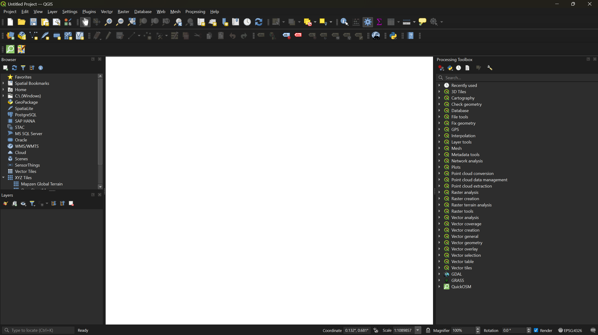
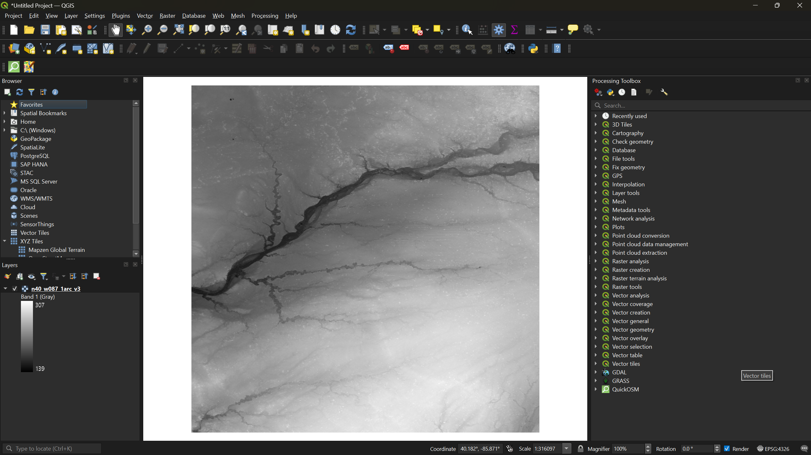
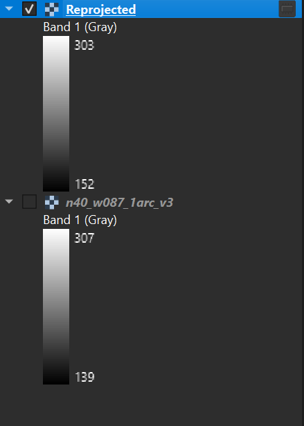
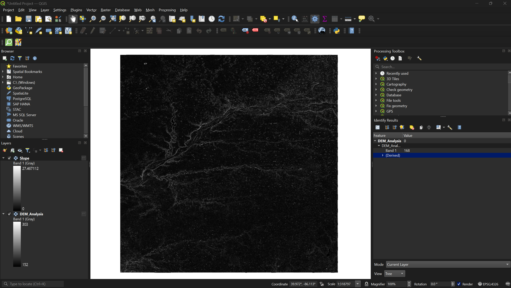
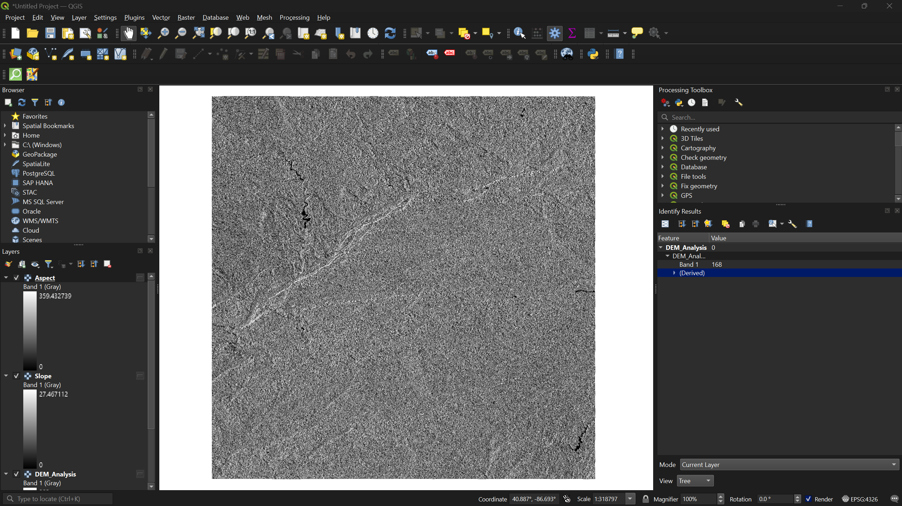
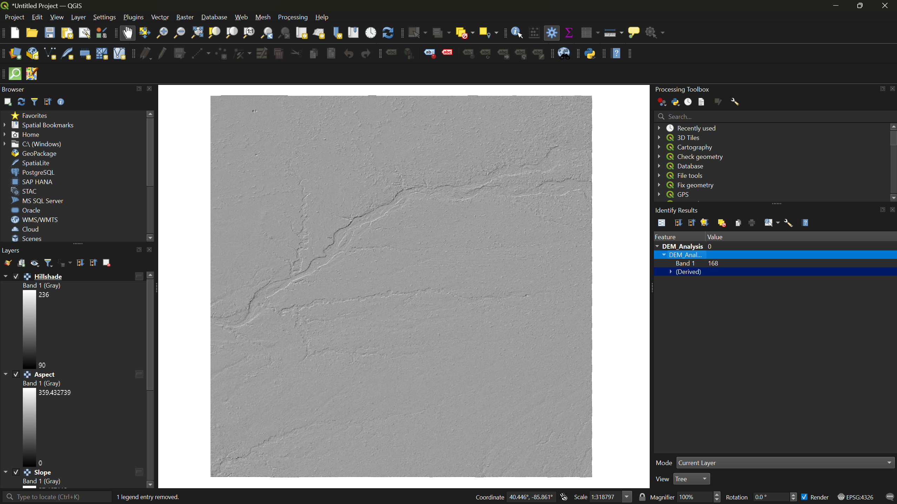
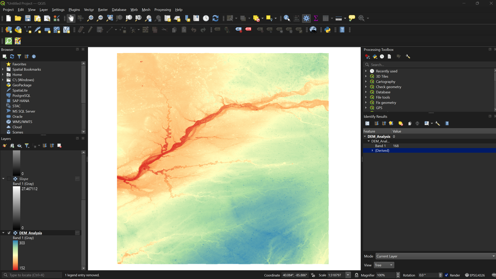

:::::::::::::::::::::::::::::::::::::: questions

- How do I load and reproject a DEM in QGIS?
- What can slope, aspect, and hillshade tell us about a landscape?
- How do I visualize elevation classes using symbology?

::::::::::::::::::::::::::::::::::::::::::::::::

::::::::::::::::::::::::::::::::::::: objectives

- Load a DEM into QGIS and reproject it to a metric coordinate system
- Generate slope, aspect, and hillshade layers from a DEM
- Apply pseudocolor symbology to visualize elevation classes

::::::::::::::::::::::::::::::::::::::::::::::::

## Introduction

QGIS offers several tools for analyzing and visualizing raster data, including digital elevation models (DEMs) and multispectral satellite imagery. In this session we will work with the SRTM DEM you downloaded from EarthExplorer in the previous session to generate slope, aspect, and hillshade layers, and then apply color symbology to visualize elevation classes.

---

## Loading the DEM

1. Open the **QGIS Desktop** application. On startup you will see a popup with two tabs: **Recent** and **Templates**.

2. Click the **Templates** tab and select the blank template option.

3. From the menu bar, click **Layer → Add Layer → Add Raster Layer**. This opens the Data Source Manager.

4. Click the three-dot button next to **Raster dataset(s)**, navigate to your DEM `.tif` file, and click **Open**, then **Add**.

The DEM will appear in grayscale on the map canvas. Darker pixels represent lower elevations and lighter pixels represent higher elevations.

---

## Reprojecting the DEM

The raw DEM uses a **geographic coordinate system** with units in degrees. For meaningful terrain analysis we need a **projected coordinate system** that uses meters.

5. Right-click your DEM layer in the **Layers** panel and select **Properties**. Under the **Information** tab, scroll to **Coordinate Reference System (CRS)** to confirm the current CRS uses geographic units. Close the dialog.

6. From the menu bar, select **Raster → Projections → Warp (Reproject)**.
   - Click the icon next to **Target CRS**
   - Select **Predefined CRS** from the dropdown
   - Search for `26916` and select **NAD83 / UTM zone 16N**
   - Click **Run**

A new layer called **Reprojected** will appear in the Layers panel.

7. Right-click the original DEM layer and select **Remove Layer**. Then right-click the reprojected layer, select **Rename Layer**, and rename it to `DEM_Analysis`.

::::::::::::::::::::::::::::::::::::: callout

### Why UTM Zone 16N?
This workshop uses study areas in Indiana, which falls within UTM zone 16N. If your area of interest is elsewhere, choose the appropriate UTM zone for your location. Check out this [website](https://epsg.io/) to find out the correct projection for your region!

::::::::::::::::::::::::::::::::::::::::::::::::

---

## Terrain Analysis

With a projected DEM we can now generate three derived layers: slope, aspect, and hillshade. All three are found under **Raster → Analysis** in the menu bar.

### Slope

8. Select **Raster → Analysis → Slope**. Ensure the input layer is `DEM_Analysis` and click **Run**.

Slope measures how steep the terrain is at each pixel — the rate of elevation change over horizontal distance. Values range from 0° (flat) to 90° (vertical cliff). Slope is commonly used to assess hiking trail difficulty, landslide risk, and water runoff potential.

### Aspect

9. Select **Raster → Analysis → Aspect**. Ensure the input layer is `DEM_Analysis` and click **Run**.

Aspect indicates which compass direction each slope faces. Values run from 0° to 360°, where 0°/360° is north, 90° is east, 180° is south, and 270° is west. Aspect is useful for analyzing sun exposure, vegetation patterns, and snowmelt behavior.

### Hillshade

10. Select **Raster → Analysis → Hillshade**. Ensure the input layer is `DEM_Analysis` and click **Run**.

Hillshade simulates how sunlight would illuminate the terrain from a given position. Brighter pixels receive more direct light; darker pixels are in shadow. Hillshade is primarily a visual aid — it makes topography easier to interpret at a glance but does not contain analytical data of its own.

:::::::::::::::::::::::::::::::::::: challenge

### Exercise 1: Compare Terrain Layers

Toggle each of the three layers (slope, aspect, hillshade) on and off in the Layers panel. For your study area, identify a feature that is most visible in one layer but hard to see in another. What does each layer emphasize?

::::::::::::::::::::::::::::::::::::::::::::::::

---

## Visualizing Elevation Classes

The grayscale DEM is hard to read. Applying a color ramp makes elevation patterns much easier to interpret.

11. In the **Layers** panel, uncheck every layer except `DEM_Analysis` so only the original DEM is visible.

12. Right-click `DEM_Analysis`, select **Properties**, and navigate to the **Symbology** tab.

13. Change the **Render type** from *Singleband gray* to **Singleband pseudocolor**. Then:
    - Set the **Color ramp** to **Spectral**
    - Set the **Mode** to **Equal Interval**
    - Click **Classify**, then **Apply**, then **OK**

Equal interval divides the full elevation range into classes of equal size. You can adjust the **number of classes** to the right of the mode selector — try different values and classification modes (e.g., quantile) to see how the visualization changes.

:::::::::::::::::::::::::::::::::::: challenge

### Exercise 2: Experiment with Symbology

1. Reopen the Symbology tab for `DEM_Analysis`
2. Try changing the classification mode from **Equal Interval** to **Quantile** — how does the map change?
3. Try a different color ramp (e.g., **Viridis** or **Magma**)
4. Increase or decrease the number of classes

Which combination do you think communicates the terrain most effectively?

::::::::::::::::::::::::::::::::::::::::::::::::

---

:::::::::::::::::::::::::::::::::::::: keypoints

- DEMs should be reprojected to a metric coordinate system (such as UTM) before performing terrain analysis.
- Slope, aspect, and hillshade are derived layers that each reveal different characteristics of the terrain.
- Pseudocolor symbology with classified elevation ranges makes DEM data far more readable than the default grayscale.

::::::::::::::::::::::::::::::::::::::::::::::::
